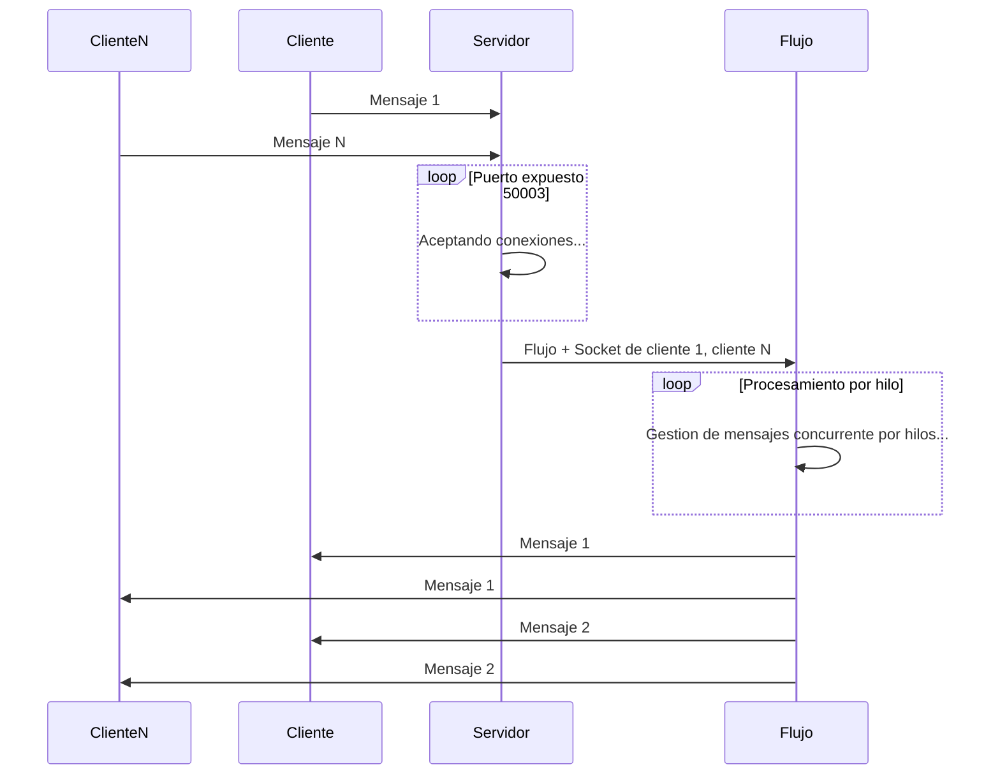

## Introduccion 

Un thread o hilo es un flujo secuencial de ejecucion de una tarea concreta. 
Tiene especial sentido usar `hilos` a la hora de llevar a cabo tareas concurrentes(o conjuntas) siguiente un orden de acceso excluivo de manera sincronizada.

Para usar este componente tenemos 2 metodos principales:

1. Heredar de la clase `Thread`. 
2. Implementar la interfaz `Runnable`.

## Diagrama 



## Resultado


&nbsp;
&nbsp;


## Sobre este proyecto

Se trata de un servidor chat que expone el puerto 50003 para aceptar conexiones entrantes de clientes.


#### Clase Servidor
```java

 public static void main (String args[])
     {
     // Declaramos el socket del servidor
     ServerSocket ss = null;
       try
       {
           // Inicializamos el socket del servidor exponiendo el puerto 50002
           ss = new ServerSocket(50004);
           
       }
       catch (IOException e)
       {
           // Notificamos error 
           System.out.println("Comunicación rechazada."+ e);
           System.exit(1);
       }
```

>1. Los clientes se conectan a traves de la clase `socket`.
   
##### Clase Servidor
```java

    // Creamos un vector (array unidimensional) para almacenar usuarios.
     public static Vector usuarios = new Vector();

```
>  Alcemacenamos los objetos instanciados en el vector `Usuarios`


##### Clase Servidor
```java

             // Aceptamos la conexion del cliente
               Socket cs = ss.accept();
             
               System.out.println("Conexion aceptada del Cliente: "+cs.getInetAddress());
             
             // Instanciamos el objeto Flujo pasando el socket del cliente. 
               Flujo flujo = new Flujo(cs);
             
             // Instanciamos el objeto Thread pasando el objeto flujo
               Thread t = new Thread(flujo);
             
             // Procesamos el hilo
               t.start();

```
>2. Instanciamos un objeto de la clase `Flujo` al que le pasamos el socket del cliente `cs`
> - Ese flujo se pasa su ejecucion a un hilo.


##### Clase Flujo
```java
 
       // El constructor Flujo acepta como parametro un socket de conexion
       public Flujo (Socket cs){
         
       
         try
         {
             // Almacenamos en buffers la entrada/salida de info del servidor
             bufferIn = new BufferedInputStream(cs.getInputStream());
             bufferOut = new BufferedOutputStream(cs.getOutputStream());
         
             // Proceso la entrada/salida de info del servidor
              in = new DataInputStream(bufferIn);
              out = new DataOutputStream(bufferOut);
         }
         catch(IOException e)
         {
             System.out.println("IOException(Flujo): "+ e);
         }
     }

```

> 3. La clase `Flujo` que hereda de la clase `Thread` el constructor requiere de un socket de cliente como parametro.
> - Guardamos el stream en buffers parar posteriormente procesar esa info y ejecutarla mediante hilos. 


##### Clase Flujo
```java
 // Adherimos el cliente al vector de usuarios
       String mensaje;
       Servidor.usuarios.add (this);
       Servidor.LogUsuarios.add(this);
       
       
       // Notificamos en el chat del nuevo usuario
       mensaje = ">Usuario "+ Servidor.LogUsuarios.indexOf(this) +" se ha conectado";
       broadcast(mensaje);

       
       // Mientras se pueda ejecutar el hilo sin errores
           while(true)
           {
                 try
                 {
                     // Guarda en una cadena el resultado codificado en UTF del mensaje procesado entrante.
                     String linea = in.readUTF();
                     
                     // Si hay informacion recibida
                     if (!linea.equals(""))
                     {
                        
                           // Concatena la Dir IP del cliente a la cadena.
                           linea =">Usuario "+ Servidor.LogUsuarios.indexOf(this)+" "+ linea;
                           
                           // Envia el mensaje al chat
                           broadcast(linea);
                     }
                 }
                 catch(IOException ioe)
                 {
                     // Si el usuario se desconecta; se elimina el objeto del vector usuarios
                     Servidor.usuarios.removeElement(this);
                     
                     // Notificamos a los usuarios del cambio
                     mensaje =">Usuario "+ Servidor.LogUsuarios.indexOf(this) +" se ha desconectado";
                     broadcast(mensaje);
                     
                     break;
                     
                 }
                     
           }
           
    }
```
>4. En la clase Flujo tenemos el motodo `void Run` herencia de la clase `Thread` para la ejecion por hilos.

- Los clientes intercambian mensajes de manera grupal gracias al metodo `broadcast`


#### Clase Flujo.
```java

     / Metodo que acepta cadenas como parametro
      public void broadcast(String mensaje)
      {
         // El hilo recupera el vector de usuarios de manera coordianada con el resto de hilos
         synchronized (Servidor.usuarios)
         {
           
             // Creamos un objeto tipo enumeration con los elementos del vector
             Enumeration e = Servidor.usuarios.elements();
             
             
             // Iteramos hasta que existan elementos 
             while (e.hasMoreElements())
             {
               
                 // Casteamos como objeto tipo Flujo para conseguir el socket de conexion del cliente
                 Flujo f = (Flujo) e.nextElement();
                 
                     try
                     {
                         // Hacemos la distribucion al cliente de manera sincronizada
                         synchronized(f.out)
                         {
                             
                             // Codificamos el mensaje al usuario por UTF
                             f.out.writeUTF(mensaje);
                             
                             // Enviamos el mensaje al usuario 
                             f.out.flush();
                         }
                     }
                     catch(IOException ioe)
                     {
                         System.out.println("Error: "+ioe);
                     }
             }
         }
```
>5. En el metodo `broadcast` notificamos de los mensajes de menera grupa de manera sincronizada entre hilos.
- Los mensajes entran de manera concurrente y sincronizada entre hilos asegurando el acceso exclusivo en el tiempo de ejecion del programa gracias al metodo `synchronized`.


